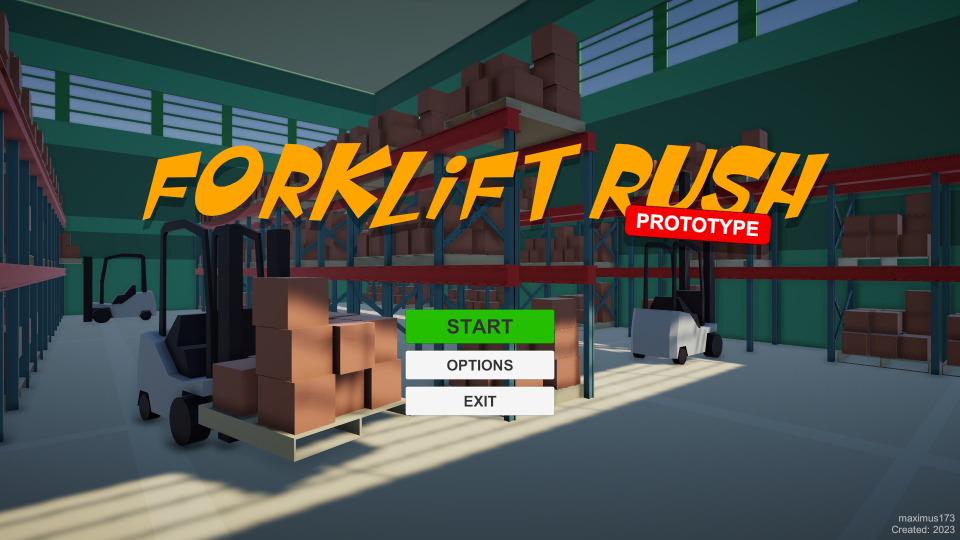
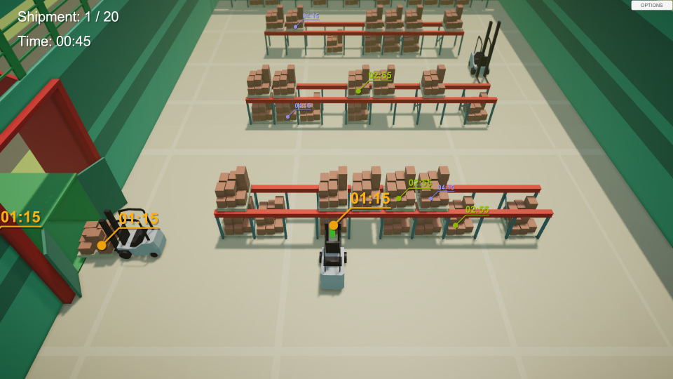

Game prepared for Unity Junior Programmer: Apply object-oriented principles. 
The game is based on a prototype project from the course. 
Project Unity version: 2020.3 
 
You can play it on https://play.unity.com/mg/other/webgl-2fb 
 
The game is about controlling forklifts to load each next truck on time. 
There is less and less time for each subsequent delivery, so all forklifts must be used skillfully. 
 

 

  
Models: provided by Unity as course materials 
Music: composed by me for this project 
https://twitter.com/maximus_173
